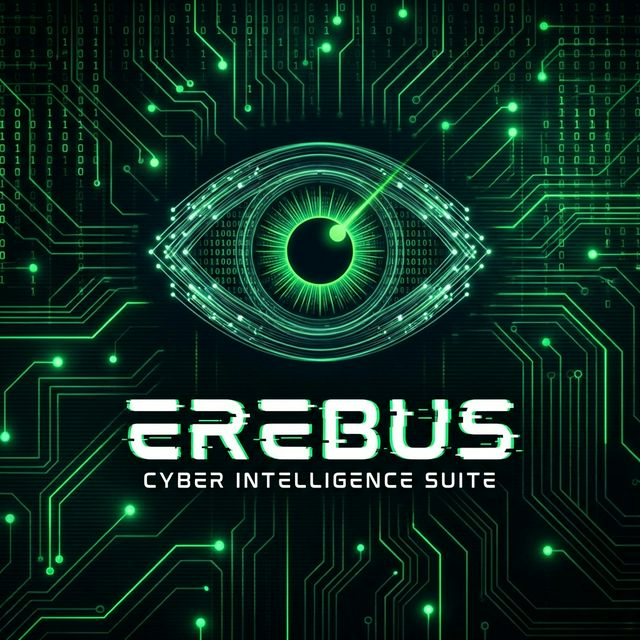

# 👁️ Erebus: AI-Powered Dark Web OSINT Tool



Erebus is an advanced OSINT tool for investigating dark web threats. It combines Tor-based crawling with local LLMs (Ollama) to find, filter, and visualize hidden service content.

## Features
- **Tor Integration**: Automatically handles Tor connections, circuit rotation, and port detection (9050/9150).
- **Search Engines**: Crawls multiple engines like Ahmia, Torch, and Haystak.
- **Direct Scraping**: Scrape specific .onion URLs directly with liveness checks and form detection.
- **AI Analysis**: Uses Ollama (LLM) to refine queries and summarize content.
- **Visual Graph**: Interactive node-link diagram showing connections between findings.
- **Artifact Detection**: Auto-extracts Emails, Crypto Addresses, SSNs, and more.
- **Reporting**: Generates professional HTML/Markdown reports.

## Installation

### Method 1: Docker (Recommended)
This method handles the Tor connection for you automatically.

1. **Prerequisites**: [Docker Desktop](https://www.docker.com/products/docker-desktop/), [Ollama](https://ollama.com/) (running on host).
2. **Run**:
   ```bash
   docker-compose up --build
   ```
3. **Access**: Open `http://localhost:8501`.

### Method 2: Local Python

1. **Prerequisites**: 
   - Python 3.10+
   - **Tor Service**:
     - **Linux/Mac**: Run `tor` (listens on 9050).
     - **Windows**: Run `Tor Browser` (listens on 9150) OR install `Tor` service.
   - **Ollama** running (`ollama serve`).

2. **Install**:
   ```bash
   pip install -r requirements.txt
   ```

3. **Run**:
   - **Windows**: Double-click `run_windows.bat`
   - **Linux/Mac**: `streamlit run app.py`
   
   *Or use the CLI:*
   ```bash
   python cli.py --query "leaked database" --report
   ```

## Configuration
Edit `.env` (copy from `.env.example` if needed) or `config.py` to change:
- `TOR_PROXY_URL`: if using a different proxy.
- `OLLAMA_BASE_URL`: if Ollama is remote.
- `TELEGRAM_BOT_TOKEN`: for alerts.

## Disclaimer
This tool is for educational and authorized testing purposes only. Accessing the dark web carries risks. Use responsibly.
